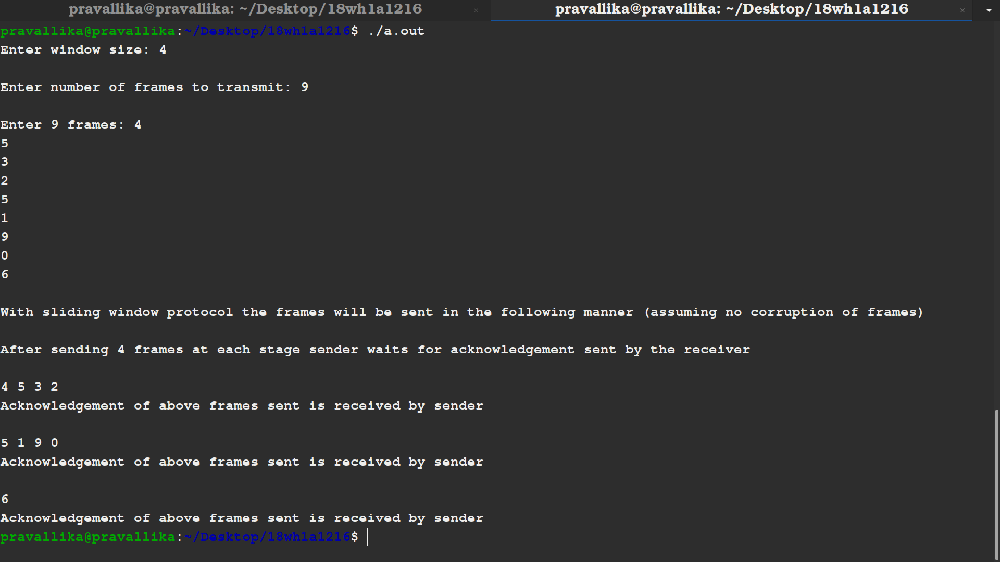
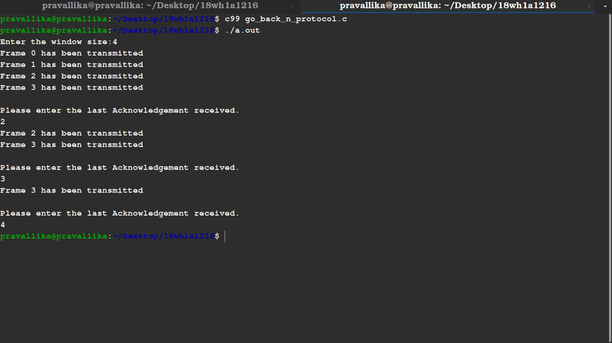

# AIM
## To write a C program to develop a simple data link layer that performs the flow control using the sliding window protocol, and loss recovery using the Go-Back-N mechanism.

# Procedure
 ### 1. Sliding Window Protocols
    
 Sliding window protocols are data link layer protocols for reliable and sequential delivery of data frames. In this protocol, multiple frames can be sent by a sender at a time before receiving an acknowledgment from the receiver.
   
In these protocols, the sender has a buffer called the sending window and the receiver has buffer called the receiving window.The size of the sending window determines the sequence number of the outbound frames. If the sequence number of the frames is an n-bit field, then the range of sequence numbers that can be assigned is 0 to 2𝑛−1. Consequently, the size of the sending window is 2𝑛−1. Thus in order to accommodate a sending window size of 2𝑛−1, a n-bit sequence number is chosen.

  
  
  
  ### 2. Go-Back-N-ARQ Protocol

 In Go-Back-N ARQ, N is the sender's window size. Suppose we say that Go-Back-3, which means that the three frames can be sent at a time before expecting the acknowledgment from the receiver.
   
In Go-Back-N ARQ, the frames are numbered sequentially as Go-Back-N ARQ sends the multiple frames at a time that requires the numbering approach to distinguish the frame from another frame, and these numbers are known as the sequential numbers.
   
1.Firstly, the sender will send the first n(window size) frames to the receiver, and now the sender is expected to receive the acknowledgment of the 0th frame.
    
2.Once the transfer of window size is completed, the sender receives the acknowledgment of the first frame, i.e., packet no1. As the acknowledgment receives, the sender sends the next packet.
     
3.Now, the sender receives the acknowledgment of packet 
   
4.After receiving the acknowledgment for packet 2, the sender sends the next packet. By repeating these steps we conclude the total transmissions required.
  
  
  
  
