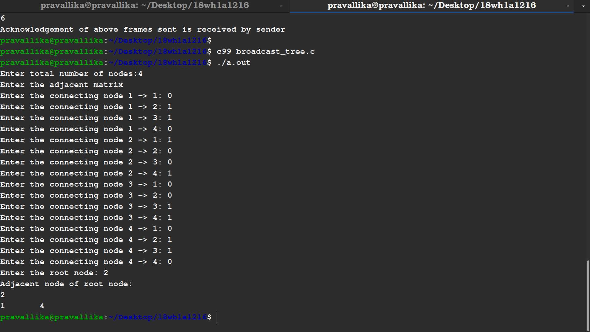

# AIM
## To write a C program by taking an example subnet of hosts and obtain a broadcast tree for the subnet.

# Procedure
 ### Broadcast tree
A broadcast sends a message from a specified root processor to all other processors.

1.Select any edge of minimal value that is not a loop. This is the first edge of T. 
   
2.Select any remaining edge of G having minimal value that does not from a circuit with the edges already included in T. 
   
3.Continue step2 until T contains n-1 edges where n is the number of vertices of G.

   
   # Output

  
  
  

  
  
