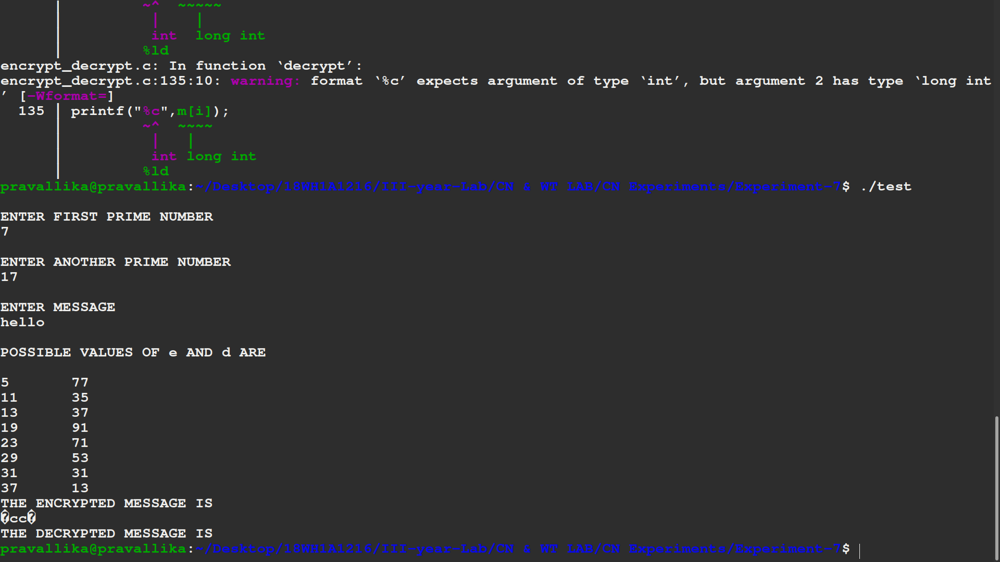

# Aim
## Write a C program Implement data encryption and data decryption

# Steps or Procedure of experiment

Step 1: Start

Step 2: Choose two prime numbers p and q.

Step 3: Compute n = p*q.

Step 4: Calculate Ф(n) = (p-1) * (q-1).

Step 5: Choose an integer e such that 1 < e < Ф (n) and gcd(e, Ф(n)) = 1; i.e., e and Ф (n) are coprime.

Step 6: Calculate d as d ≡ e−1 (mod Ф (n)); here, d is the modular multiplicative inverse of e modulo Ф(n).

Step 7: For encryption, c = m^e mod n, where m = original message.

Step 8: For decryption, m = c^d mod n.

Step 9: Stop

# Output

