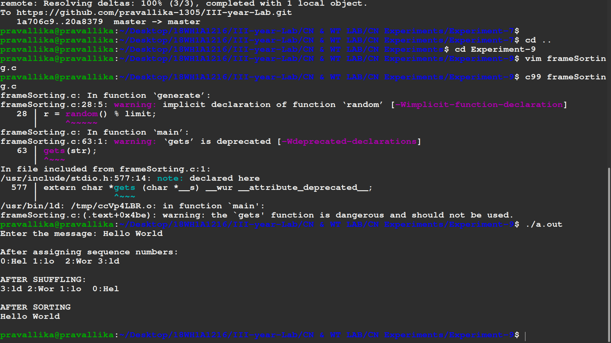

# Experiment 9

## Aim of the Experiment
Write a C program for frame sorting technique used in buffers

## Steps or Procedure of experiment

Step 1: Start

Step 2: Read the message

Step 3: Declare the function assign_seq_no() to assign sequence numbers to the frames(frames contain the original message)

Step 4: Generate array of random numbers

Step 5: Declare shuffle() to shuffle the frames within the network.

Step 6: Declare sort() that sorts the frames. In this you need to search for frames in sequence based on sequence number.

Step 7: Finally you need to print the original message.

Step 8: Stop

## Output

