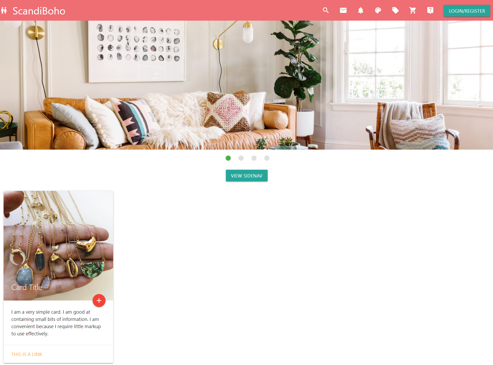

# Experimet 1

## Aim of the Experiment
Develop static pages (using Only HTML) of an online book store. The pages should resemble: www.amazon.com. The  website should consist the following  pages.
a)Home page
b)Registration and user Login
c)User Profile Page
d)Books catalog
e)Shopping Cart 
f)Payment By credit card
g)Order  Conformation

### Components

#### Home.html
Usage of image slider, navbar, cards, side navbar, icons and buttons.

 
 
  
#### Register.html
Usage of filetype, radio buttons and forms.

 
