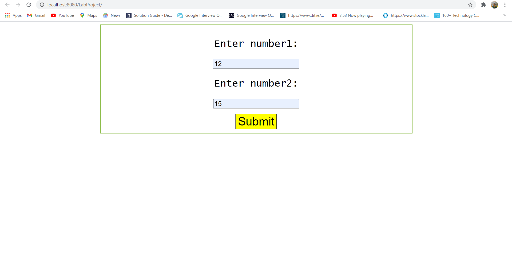

# AIM
## To create a servlet that calculates sum of 2 numbers given as input.
  
# Procedure
 1) On Eclipse, create a new dynamic web project by checking the option for producing deployment descriptor file.
   
 2) Now, create a HTML file inside WebContent directory of the project that contains a form with 2 input fields for entering numbers and a submit button.
    
 3) Create a package for calculating sum inside "src" folder and write the code for a servlet that adds the 2 numbers.
    
 4) Configure the web.xml file and start the apache tomcat server.
    
 5) Run the project on server.
   
# Output

  

